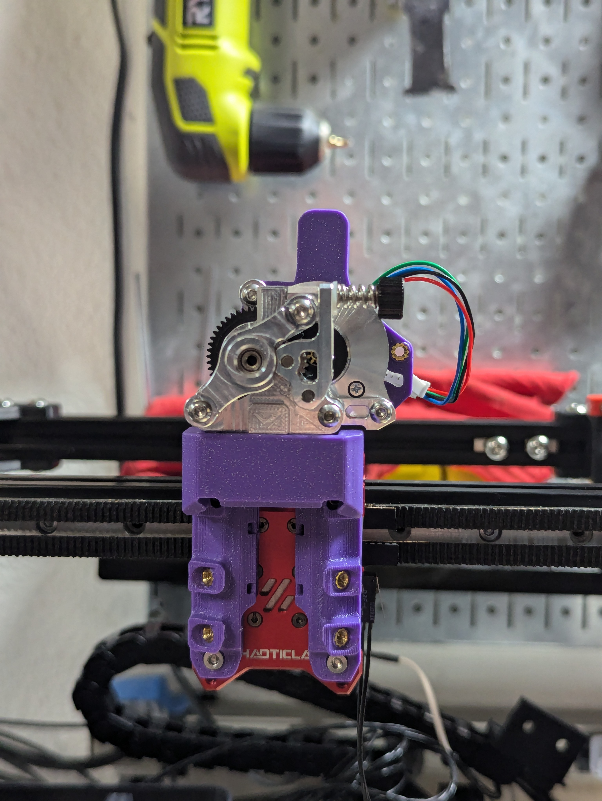
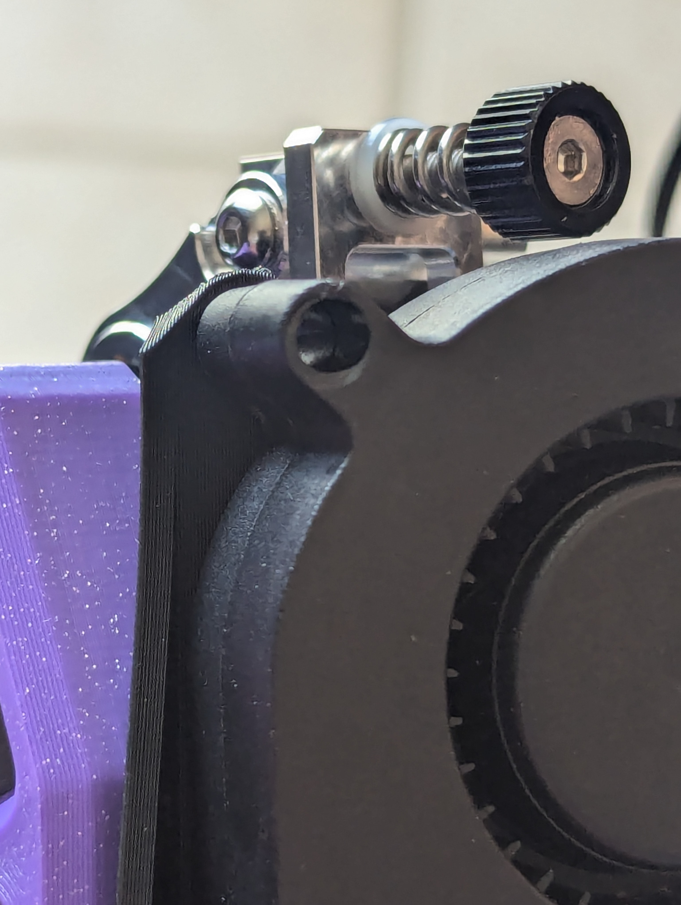
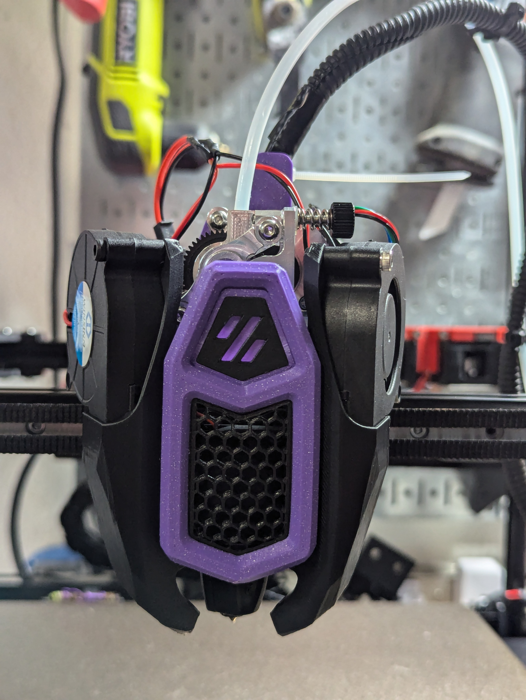

This modifies the TAP extruder mount for the VZ Hextrudort (low) extruder. `STL/Extruder Mounts/TAP/HextrudortLOW CNC TAP.stl`

All it really does, is moves the extruder another 4mm away from the hotend, allowing the tension screw to *just* clear the right 5015 fan.

I've been testing it for about 48hr worth of prints, and it's working as expected!

Just the extruder mount and extruder

Clearance

This is what it looks like all together.
